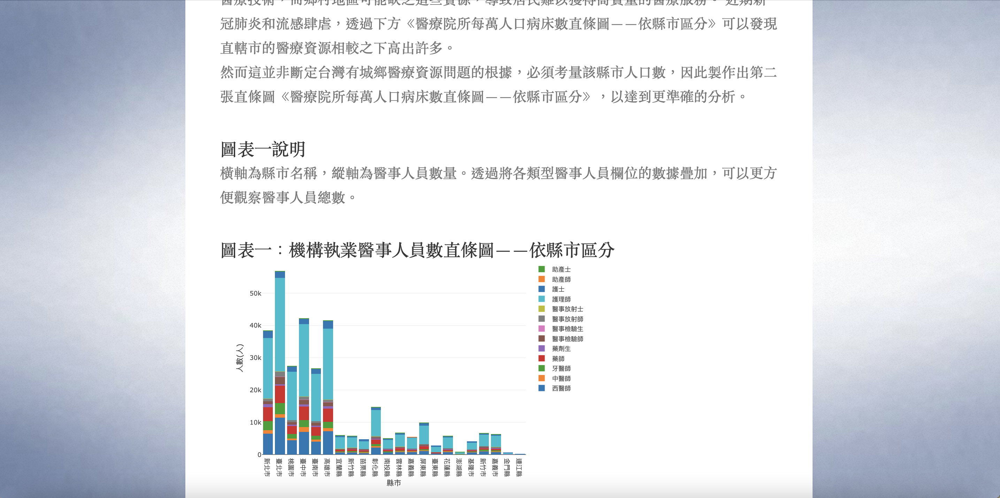

# Individual DataViz Midterm Project
- purposes : 
	- Understanding and utilizing HTML, JavaScript, CSS 
	- Visualizing data from daily life by utilizing Plotly.js
	- Building own website by using GitHub Pages

- website template from https://github.com/afeinstein20/afeinstein20.github.io

- charts
	- Lines & scatters
	- Bar charts
	- Pie charts
	- Histogram
# DEMO

---
一些心得
1. 記得連網路再 Go live，否則部分東西跑不出來，像是icon和d3讀取的資料。 
2. index.html裡，data資料夾裡.csv檔的讀取記得放在main.js的前面 
3. 要先x=[]和y=[]才可以對特定索引值得位置賦值。 
4. style.css的檔案要用href讀取。 
5. index.html要放在最外側，否則會找不到檔案(404)。 
6. 用Chrome開發者工具去尋找錯誤會很方便。
